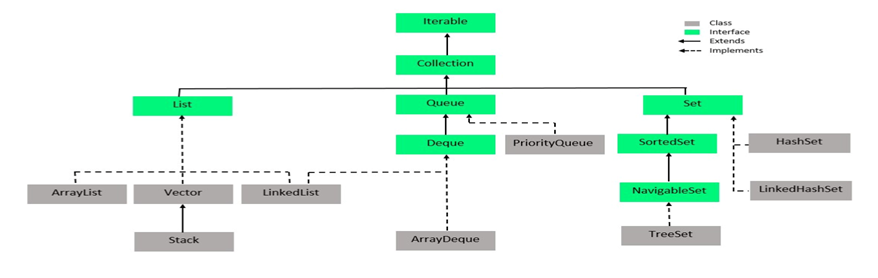

# Java Collections
#### Java koleksiyonları çerçevesi, çeşitli veri yapılarını ve algoritmaları uygulamak için bir dizi arabirim ve sınıf sağlar.
#### Resimde de görüleceği gibi Java koleksiyonları çeşitli arabirimler sağlar. Bu arabirimler, koleksiyonlar üzerinde farklı işlemler gerçekleştirmek için çeşitli yöntemler içerir.

#### Koleksiyon(Collection) arabirimi, koleksiyon çerçevesi hiyerarşisinin kök arabirimidir.
#### Java, Collection arabiriminin doğrudan uygulamalarını sağlamaz, ancak aşağıdakiler gibi alt arabirimlerinin uygulamalarını sağlar: List,Queue,Set vb. şekilde

### <b> <i>Collections framework VS Collection interface</i> </b>

#### Collection interface, Collection framework’ün kök arabirimidir. Framework, diğer arayüzleri de içerir: Map ve Iterator gibi. Bu arayüzlerin alt arayüzleri de olabilir.
