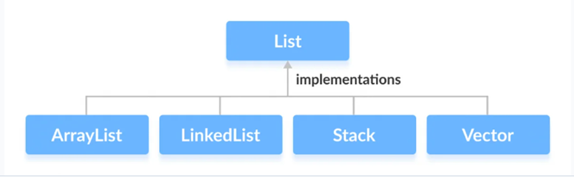

### Java List
#### Java List Interface
Liste arabirimi, dizi gibi öğeleri eklememize ve çıkarmamıza izin veren sıralı bir koleksiyondur.
List bir interface olduğu için ondan nesneler oluşturamıyoruz. List arayüzünün fonksiyonlarını kullanmak için şu sınıfları kullanabiliriz:

- ArrayList
- LinkedList
- Stack
- Vector

