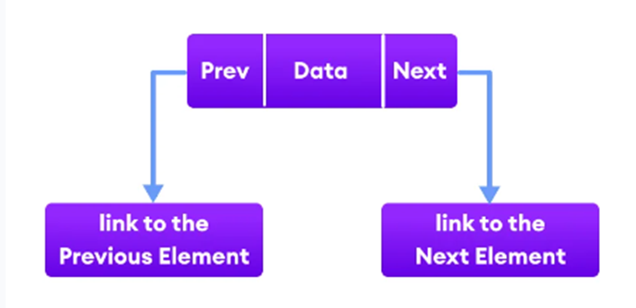

### Java LinkedList

#### Java koleksiyonları çerçevesinin LinkedList sınıfı, bağlantılı liste veri yapısının (çift bağlantılı liste) işlevselliğini sağlar.
Bağlantılı bir listedeki her öğe bir düğüm olarak bilinir. 3 alandan oluşur:

- Prev : Listede bir önceki elemanın adresini saklar. İlk eleman için null olacaktır.
- Next : Listede bir sonraki elemanın adresini saklar. Son eleman için null oalcaktır.
- Data : Gerçek verinin kendisidir.

### <i><b>LinkedList Vs ArrayList </b></i>

- LinkedList 3 değeri (önceki adres, veri ve sonraki adres) tek bir konumda saklarken ArrayList tek bir değeri tek bir konumda saklar.
- LinkedList çift bağlantılı liste uygulamasını sağlarken ArrayList iste yeniden boyutlandırılabilir bir dizi uygulaması sunar.
- LinkedList’de bir öğe eklendiğinde, önceki ve sonraki adres değiştirilirken ArrayList’de konumundan sonraki tüm değerler kaydırılır.
- LinkedList’de bir öğeye erişmek için, baştan öğeye kadar gezmemiz gerekirken ArrayList’de dizinleri kullanarak öğelere rastgele erişebilir.
