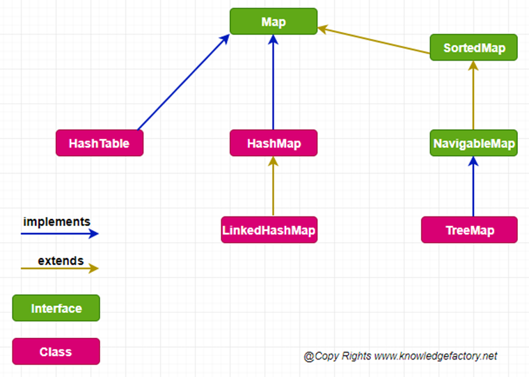

### Java Map

#### Map (gönderim) anahtarları değerlere eşleştiren bir nesnedir. Örneğin, bir ad listesinde her ada bir sıra numarası vermek bir Map (gönderim) işlemidir. Bu işlemde sıra numaralarının her biri bir anahtar, her ad bir değer olur. Liste karışmasın diye her ada ayrı bir sıra numarası verilir. Sıra numaraları anahtarlar, adlar ise değerlerdir. Sıra numaraları birbirlerinden farklıdır; ancak adlar farklı olmayabilir