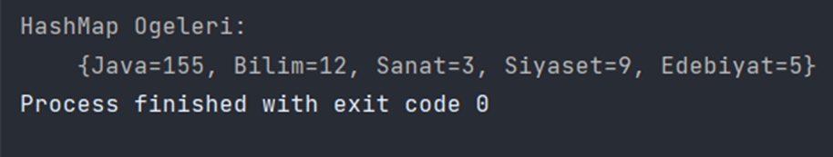

### Java HashMap

#### Map içindeki sıralama, koleksiyon üzerinde tanımlanan iteratörün öğeleri bize veriş sırasıdır. Ancak HashMap yapısında sıra belirli değildir.

` map.put("Bilim", "12"); ` 
`map.put("Sanat", "3");  ` 
`map.put("Edebiyat", "5"); ` 
`map.put("Siyaset", "9"); ` 
`map.put("Java", "155"); `

